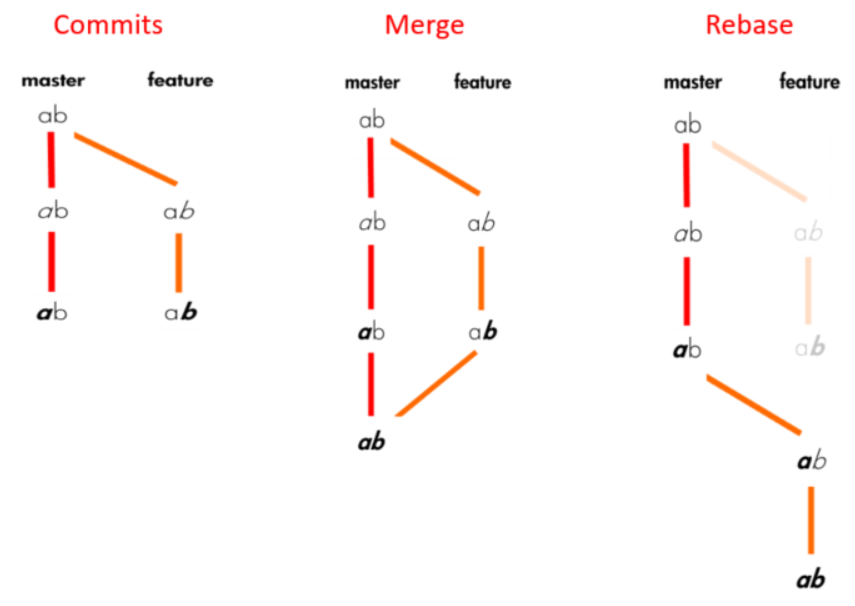

## 
Comandos Git

| COMANDOS | VARIAÇÃO | FUNÇÃO |
|---|---|---|
|**version** |**--version**|Mostra a versão instalada; |
|**init**|**init**   **init --bare** *(usado para tornar o repositório remoto)* |<li>Inicia o repositório;</li> <li>Repositório puro, conterá as alterações feitas, e não a cópia de cada arquivo;</li>|
|**status**|**status**|Verifica e documenta o estado do repositório atual;|
|**config**|**config --local user.nome**   **config --local user.email**   **config --global user.nome**   **config --global user.email**|<li>Declara o **nome** do usuário no **repositório local**;</li> <li>Declara o **email** do usuário no **repositório local**;</li> <li>Declara o **nome** do usuário no **repositório global**;</li> <li>Declara o **email** do usuário no **repositório global**;</li>|
|**add**|**add .**   **add *identificação***|<li>Adiciona todas as últimas configurações, sem nomeá-las;</li> <li>Abre o arquivo para adicionar commit's;</li>|
|**commit**|**commit –m " "**|Usado para adicionar mensagem ao *commit* que será salvo;|
|**config**|**config --global** *ou* **local**|<li>Modifica as configurações.</li> **global:** Máquina como um todo;   **local:** Cada projeto;|
|**log**|**log**   **log --oneline**   **log -p**|<li>Mostra as commits;</li> <li>Mostra as commits resumidas em uma **única linha**;</li> <li>Mostra as informações de commit com **as alterações detalhadas**;</li>|
|**remote**|**remote**   **remote add *nomedesejado*** + ***endereçodorepositório***   **remote rename *nomeatual*** + ***novonome***   **remote -v**|<li>Mostra os repositórios reconhecidos;</li> <li>Adiciona o repositório citado;</li> <li>Renomeia repositório;</li> <li>Mostra o caminho do repositório;</li>|
|**clone**|**clone *endereçodorepositório***|Clona o repositório em questão;|
|**push**|**push *identificação*** + ***linhadetrabalho*** *(ex:master)*|Envia dados de alterações para o repositório desejado, como *commits* e **tags**;|
|**pull**|**pull *identificação*** + ***linhadetrabalho*** *(ex:master)*|Copia os dados de alterações do repositório desejado;|
|**branch**|**branch**   **branch *identificação***|<li>Consultar *branches* criadas;</li> <li>Adiciona uma nova *branche*;</li>|
|**checkout**|**checkout *identificação***   **checkout --*identificação***|<li>Muda para a *branche* ou *commit* citada;</li> <li>Descarta última alteração que não foi *commitada*;</li>|
|**merge**|**merge *branch1* *branch2***|Cria uma *commit* em comum para unir as *branches*;|
|**rebase**|**rebase *branch1* *branch2***    |Alinha *branches* e suas *commits* de forma ordenada;|
|**reset**|**reset HEAD *nomedoarquivo***|Desfaz alteração que estava em **aberto**, ou seja, que ainda não havia sido *commitado*;|
|**revert**|**revert *códigodocommit***|Reverte *commit* salvo;|
|**stash**|**stash**   **stash list**   **stash *númerodoitem***   **stash drop**   **stash pop**|<li>Guarda alterações para depois, **sem commitá-las**;</li> <li>Lista *stashs* existentes;</li> <li>Recupera alteração salva para depois;</li> <li>Apaga alteração salva para depois;</li> <li>Recupera alteração salva para depois, **e apaga** da lista;|
|**diff**|**diff**   **diff *númerocommit1* .. *númerocommit2***|<li>Mostra alterações que ainda não foram commitadas;</li> <li>Mostra alterações feitas de uma *commit* até outra *commit*;</li>|
|**tag**|**tag**   **tag –a *nomedesejado***|<li>Mostra as tags existentes;</li> <li>Gera uma nova tag;</li>|
 

**HEAD:** Estado atual do nosso código, ou seja, onde o Git nos colocou  
**Working tree:** Local onde os arquivos realmente estão sendo armazenados e editados  
**index:** Local onde o Git armazena o que será commitado, ou seja, o local entre a working tree e o repositório Git em si.

#### -Tecla Q para sair do git log -p  

**-Para voltar no tempo nos commits:**  
**git log --oneline**
Anote o número de identificação do *commit* que deseja ir
**git checkout *númerodeIDE***
*Caso queira salvar as alterações feitas nesse *commit*, crie uma nova *branch* para realizar as alterações, e depois **sincronize** com merge ou rebase à *branch* principal.
